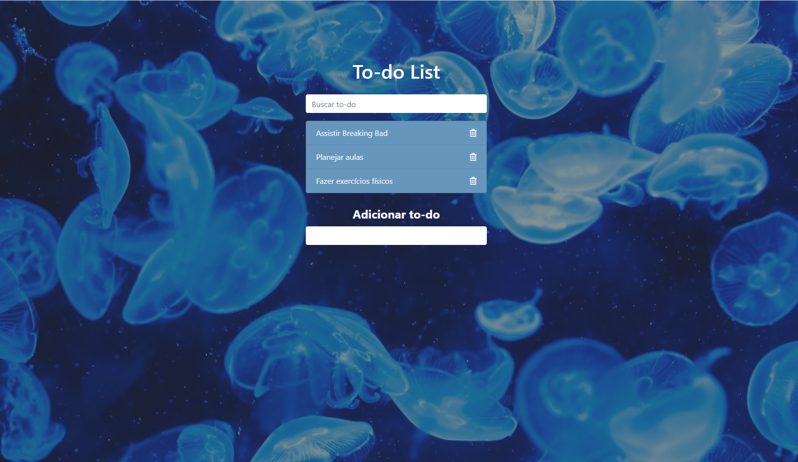

<h1 align="center">
    To do list
</h1>

<h1 align="center">

  </h1>

<h3 align="center">
    <a href="https://todo-list-ju.netlify.app/">Access demo page</a>
<h3 >

# Index

- [About](#-about)
- [Technologies used](#-technologies-used)
- [How to download the project](#-how-to-download-the-project)

## 🔖&nbsp; About

The To do List is a project created in a Roger Melo's JS (CJRM) Course to criate a to do list using Bootstrap to layout and JS to add ande removes tasks in a to do list. It is a project created in order to put into practice part of the course content as *DOM's manipulation, array methods(map, filter, forEach and reduce) and conditionals.* 

---

## 🚀 Technologies used

The project was developed using the following technologies

- Semantic HTML5 markup
- CSS custom properties
- Bootstrap
- JavaScript
- Mobile-first workflow
- VS Code

---

## 🗂 How to download the project

    - Clone the repository
    - Enter directory
    - Install dependencies
    - Start project
   
---

Developed ❤ by Juliana Fernandez

